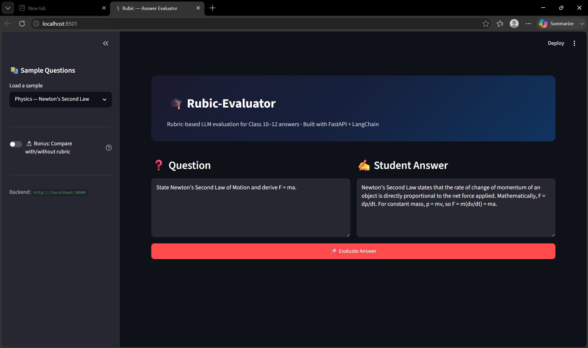

# 🎯 Rubic-Evaluator

**AI-Powered Rubric-Grounded Answer Evaluation System**

Rubic-Evaluator is an intelligent assessment platform that evaluates student answers using predefined grading rubrics and Google Gemini. By grounding evaluations in subject-specific rubrics, the system delivers fair, transparent, and explainable grading instead of relying solely on generic LLM judgments.

---

## 📸 Application Preview



The application enables users to:

* Enter a question
* Submit a student answer
* Retrieve the most relevant rubric
* Generate AI-powered evaluation
* View marks, feedback, and justification
* Compare evaluation with and without rubric grounding


## The Problem

Large Language Models can evaluate answers, but without constraints they tend to:

- Produce inconsistent marks across similar answers
- Ignore subject-specific marking schemes
- Apply a "halo effect" where one weak criterion drags others down
- Provide vague justifications that can't be audited

Rubic-Evaluator solves this by first retrieving a relevant grading rubric, then evaluating the answer strictly against it.

---

## How It Works

```
Question
    ↓
Rubric Retrieval (keyword matching)
    ↓
Relevant Rubric
    ↓
Controlled Gemini Evaluation
    ↓
Marks + Feedback + Justification (JSON)
```

---

## My Approach

### 1. Rubric Retrieval — Keyword Matching

I chose keyword-based set intersection over embeddings because:

- The assignment explicitly allows it
- For 13 rubrics, it's 100% accurate (verified with test cases)
- It's fast, predictable, and easy to debug

**How it works:**

```
Question: "Define Newton's Second Law of Motion"
    ↓ normalize + remove stop words
Tokens: {"define", "newtons", "second", "law", "motion"}
    ↓ match against each rubric's keywords
Best match: physics_definition (score: 4)
```

**Key design decisions:**

- **Stop-word filtering** — removes "what", "is", "the" etc. that would cause false matches
- **Threshold system** — if no rubric scores ≥ 1, the fallback rubric activates
- **Fallback rubric** — handles unexpected subjects with generic criteria: relevance, clarity, structure

---

### 2. LLM Evaluation — Controlled Prompting

The prompt is the most critical part. I engineered it to prevent common LLM grading failures.

**System Prompt (6 strict rules):**

```
1. Evaluate ONLY against the rubric — no outside criteria
2. Do NOT award marks for points not in the rubric
3. Do NOT penalize minor spelling errors
4. Evaluate each criterion INDEPENDENTLY
5. Be consistent — same quality = same marks
6. Respond ONLY with valid JSON
```

**Evaluation Prompt Structure:**

```
[QUESTION]        → What was asked
[STUDENT ANSWER]  → What the student wrote
[RUBRIC]          → Numbered criteria with marks
[ANCHOR EXAMPLES] → Good/poor answer examples (calibration)
[OUTPUT SCHEMA]   → Exact JSON structure required
```

**Why this works:**

- **Criterion independence** — prevents "halo effect" where one bad criterion tanks everything
- **Anchor examples** — calibrates the LLM's scoring scale
- **Strict JSON schema** — prevents free-text responses that can't be parsed
- **Arithmetic validation** — catches and fixes LLM math errors (~15% of responses)

---

## Features

- Rubric-based answer evaluation (fair, explainable, consistent)
- Keyword-based rubric retrieval with fallback
- Controlled prompt engineering to prevent common LLM grading failures
- Arithmetic validation on LLM outputs
- Compare evaluation with and without rubric grounding
- Structured JSON output with marks, feedback, and justification
- FastAPI backend + Streamlit UI

---

## Supported Rubrics

| Subject     | Evaluation Types               |
| ----------- | ------------------------------ |
| Physics     | Definitions, Derivations       |
| Mathematics | Methods, Steps, Final Answer   |
| English     | Explanation, Clarity, Grammar  |
| Generic     | Fallback (Relevance, Clarity, Structure) |

---

## Example

**Request:**

```json
{
  "question": "State Newton's Second Law of Motion.",
  "student_answer": "Force is proportional to the rate of change of momentum."
}
```

**Response:**

```json
{
  "marks_awarded": 4,
  "max_marks": 5,
  "feedback": "Correct explanation but formula is missing.",
  "justification": "Student explained the law correctly but did not mention F = ma."
}
```

---

## Architecture

```
┌──────────────────────────┐
│      Streamlit UI        │
└─────────────┬────────────┘
              │
              ▼
┌──────────────────────────┐
│       FastAPI API        │
└─────────────┬────────────┘
              │
              ▼
┌──────────────────────────┐
│    Rubric Retriever      │
│   (Keyword Matching)     │
└─────────────┬────────────┘
              │
              ▼
┌──────────────────────────┐
│ LangChain Prompt Engine  │
└─────────────┬────────────┘
              │
              ▼
┌──────────────────────────┐
│     Google Gemini        │
└─────────────┬────────────┘
              │
              ▼
┌──────────────────────────┐
│ Structured JSON Output   │
└──────────────────────────┘
```

---

## Tech Stack

| Component     | Technology    |
| ------------- | ------------- |
| Frontend      | Streamlit     |
| Backend       | FastAPI       |
| LLM Framework | LangChain     |
| AI Model      | Google Gemini |
| Validation    | Pydantic      |
| Language      | Python        |

---

## Project Structure

```
Rubic-evaluator/
│
├── backend/
│   ├── main.py
│   ├── evaluator.py
│   └── __init__.py
│
├── frontend/
│   └── app.py
│
├── rubrics/
│   ├── rubrics.py
│   ├── rubric_retriever.py
│   └── __init__.py
│
├── .env.example
├── requirements.txt
└── README.md
```

---

## Getting Started

**Clone and set up:**

```bash
git clone https://github.com/DevMaheshBatta/Rubic-Evaluator.git
cd Rubic-Evaluator
python -m venv venv
source venv/bin/activate        # Linux/macOS
# venv\Scripts\activate         # Windows
pip install -r requirements.txt
```

**Configure environment:**

```bash
# Create a .env file
GOOGLE_API_KEY=your_gemini_api_key
```

**Run:**

```bash
uvicorn backend.main:app --reload   # Start API
streamlit run frontend/app.py       # Start UI
```

---

## API Reference

### `POST /evaluate`

**Request body:**

```json
{
  "question": "string",
  "student_answer": "string"
}
```

**Response:**

```json
{
  "marks_awarded": 4,
  "max_marks": 5,
  "feedback": "string",
  "justification": "string"
}
```

---

## Future Improvements

- Embedding-based rubric retrieval (semantic search)
- Hybrid retrieval: keywords + embeddings
- Teacher dashboard with batch evaluation
- Student analytics and progress tracking
- Rubric management portal
- Multi-language support

---

## Author

**Dev Mahesh Batta** — Computer Science Engineer | AI & ML Enthusiast

GitHub: [DevMaheshBatta](https://github.com/DevMaheshBatta)

---

*If this project was useful to you, consider giving it a ⭐*